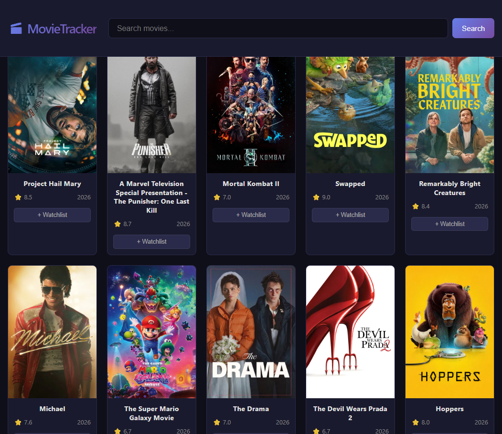
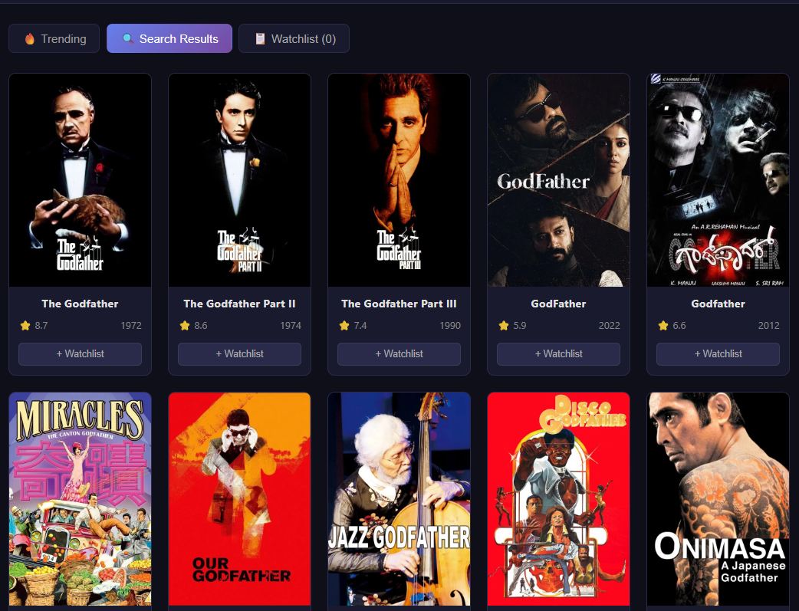
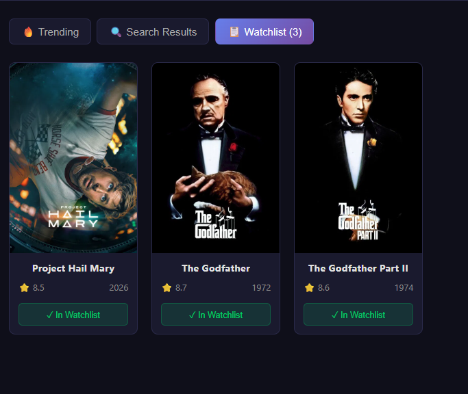

# 🎬 MovieTracker

A full-stack movie tracking web app built with **React, Node.js, Express, and the TMDB API**.
Search movies, view details, and manage your personal watchlist.


## ✨ Features

- **Movie Search** — Search from TMDB's database of 500,000+ movies
- **Trending** — Weekly trending movies on the home screen
- **Movie Details** — Ratings, runtime, genres, cast
- **Watchlist** — Add/remove movies, persisted in localStorage
- **Responsive UI** — Works on all screen sizes

## 🛠️ Tech Stack

| Layer | Technology |
|-------|-----------|
| Frontend | React 18, Vite, CSS3 |
| Backend | Node.js, Express |
| API | TMDB REST API |
| State | React Hooks (useState, useEffect) |
| Storage | localStorage |

## 🚀 Getting Started

### Prerequisites
- Node.js 18+
- TMDB API key (free at [themoviedb.org](https://www.themoviedb.org/signup))

### Installation

```bash
git clone https://github.com/ruckfuss/movie-tracker.git
cd movie-tracker

# Backend
cd server
npm install
echo "TMDB_API_KEY=your_key_here" > .env
node index.js

# Frontend (new terminal)
cd ../client
npm install
npm run dev
```

## 📁 Project Structure
movie-tracker/
├── server/
│   ├── index.js        # Express API server
│   └── .env            # API keys (not committed)
├── client/
│   └── src/
│       ├── App.jsx     # Main React component
│       └── App.css     # Styling
└── README.md

## 📸 Screenshot




## 📌 What I Learned

- Building REST APIs with Node.js and Express
- React component architecture and hooks
- Third-party API integration (TMDB)
- Frontend-backend communication
- State management with localStorage persistence